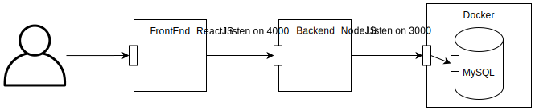
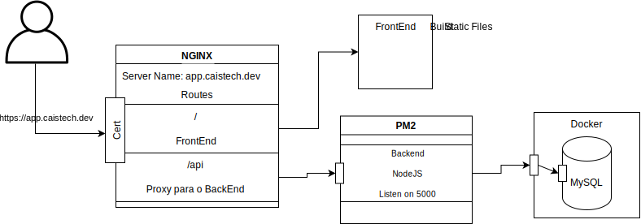
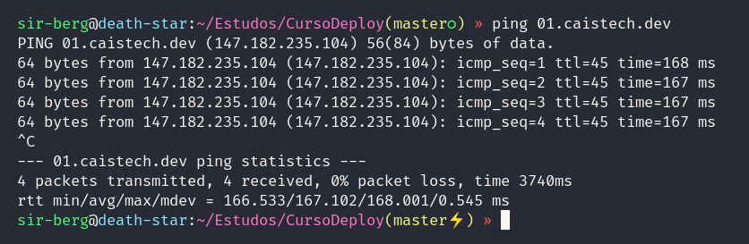
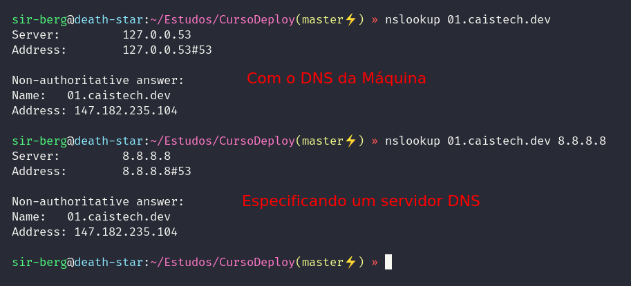
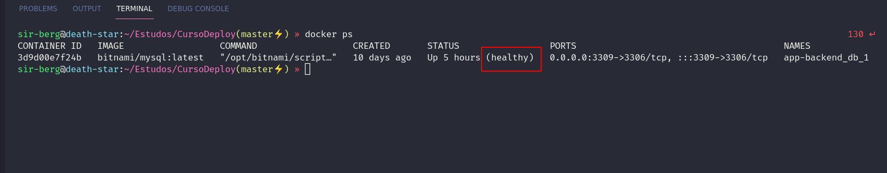

# Deploy de aplicação Frontend e Backend utilizando NGINX e PM2.

---

## 1 - Objetivo deste minicurso:

Ensinar o "rumo", ou o mínimo necessário para subir uma aplicação WEB.

---

## 2 - Apresentação da Aplicação

#### Arquitetura:

<figure class="image">
  
  <figcaption><b>Infraestrutura Local</b></figcaption>
</figure>

#### Técnologias utilizadas:

- **FrontEnd**: ReactJS
- **BackEnd**: NodeJS
- **Banco de Dados**: MySQL (no Docker)

#### Arquitetura após o Deploy (nosso alvo!!)

<!-- Providenciando um servidor -->

<figure class="image">
  
  <figcaption><b>Infraestrutura após o Deploy</b></figcaption>
</figure>

---

## 3 - Requisitos

- Um endereço DNS
- Uma máquina com IP público (para subir com domínio).

#### 3.1 - DNS

##### O que é?

Domain Name System (Sistema de nome de domínio), converte nomes de domínios legíveis por humanos (por exemplo, caistech.dev) em endereço IP legíveis por máquinas. [AWS](https://aws.amazon.com/pt/route53/what-is-dns/).

##### Onde conseguir?

- [Google Domains](https://domains.google/)
- [Hostgator](https://www.hostgator.com.br/)
- [Locaweb](https://www.locaweb.com.br/)
- [GoDaddy](https://www.godaddy.com/pt-br)

##### Criando um Registro

Para que o nosso endereço DNS se torne efetivo, precisamos apontar um nome para um servidor. Para isso, precisamos criar um [registro](https://www.dialhost.com.br/ajuda/o-que-sao-tipos-de-registro/) do tipo "A",que serve para apontar um nome para um IPv4. Para IPv6, utilizamos o registro](https://www.dialhost.com.br/ajuda/o-que-sao-tipos-de-registro/) do tipo "AAAA".

##### Testando o Registro

Para testar o apontamento, podemos utilizar as seguintes ferramentas:

- **ping**

  - Quando realizamos um ping para um domínio, ele automaticamente é resolvido, e na saída mostra o IP do servidor.
  <figure class="image">
    
    <figcaption style="text-align: center;"><b>Saída do Ping</b></figcaption>
  </figure>

- **nslookup**

  - O nslookup é uma ferramenta no qual informa qual é o IP associado à um nome.
  <figure class="image">
    
    <figcaption style="text-align: center;"><b>Saída do nslookup</b></figcaption>
  </figure>

- Ou um site, que diz onde o endereço já está sendo anunciado, como o [WhatsMyDNS](https://www.whatsmydns.net/#A/01.caistech.dev).

#### 3.2 - Máquina com IP Público

##### Onde Conseguir?

Algumas opções de serviços em nuvem

- [AWS](https://aws.amazon.com/pt/)
  - Oferece EC2 por 1 ano gratuído.
- [DigitalOcean](https://www.digitalocean.com/)
- [Microsoft Azure](https://azure.microsoft.com/pt-br/)

##### Nosso caso, a DigitalOcean

Para provisionar um servidor na DigitalOcean, basta criarmos um [Dopplet](https://www.digitaloceanbr.com.br/como-criar-droplet-digitalocean.html) (isso depois que criarmos nossa conta e adicionarmos nosso cartão de crédito).

---

## 4 - Configurando o Servidor e Realizando o Deploy

#### 4.1 - Instalando dependências

- NGINX
  - Servir a aplicação Web.
  - Proxy para o Backend.
  - Instalação:
    ```bash
    sudo apt install nginx
    ```
- [Docker](https://www.digitalocean.com/community/tutorials/how-to-install-and-use-docker-on-ubuntu-20-04-pt)

  - Para o banco de dados.

- Docker Compose
  - Rodar a infra no código.
  - Instalação:
    ```bash
    sudo apt install docker-compose
    ```
- Git
  - Repositório da aplicação.
  - Instalação:
    ```bash
    sudo apt install git
    ```
- [NodeJS](https://nodejs.org/en/download/package-manager/)
  - Yarn
  - [PM2](https://pm2.keymetrics.io/)
  - Instalação:
    ```bash
    sudo npm install -g pm2 yarn
    ```
- [CertBOT](https://certbot.eff.org/lets-encrypt/ubuntufocal-nginx)

  - HTTPS
  - Instalação:

    ```bash
    sudo snap install certbot --classic
    ```

- Criando o usuário "caistech", um user sem acesso root.
  - No braço, alterando o arquivos `/etc/passwd` e `/etc/group/`.
  - Via linha de comando:
    - [Tutorial](https://marquesfernandes.com/desenvolvimento/como-criar-um-usuario-sudo-no-linux-debian-ubuntu/)

> **É válido observar que como estamos subindo uma aplicação JavaScript, existe os requisitos do Node, mas para outras técnologias, é necessário cumprir o pré-requisito para rodar a aplicação**

#### 4.2 - Preparando e rodando o Backend

##### 4.2.1 - Processo Genérico (fácilmente alterável)

1. Baixar o código do Git (ou do lugar que o código é mantido);
2. Providenciar as dependências do projeto (libs, arquivo de configuração, criação de pastas, acesso ao banco de dados, etc...);
3. Executar um processo de Build (caso houver);
4. Tornar a aplicação disponível em algum gerenciador de processos (`PM2`), ou até mesmo, em um container, utilizando o `docker`.
   - Tal gerenciador precisa deixar o serviço da aplicação 100% disponível.

##### 4.2.2 - Aplicando o processo acima para o nosso caso...

###### **4.2.2.1 - Baixar o código do Git**

Basta clonar o nosso projeto, em: https://github.com/wallberg13/CaisTech2021

###### **4.2.2.2 - Providenciar as depedências do projeto**

1. **Instando dependências**
   Basta um `yarn`.
2. **Preparando o .env da aplicação.**

   - O .env é um arquivo de configurações, com as variáveis necessárias para o funcionamento da nossa aplicação, como credenciais de banco de dados, chaves de API, e etc...
   - Basicamente, o que precisamos fazer é preencher o arquivo.

3. **Banco de Dados**

   - O nosso banco de dados será servido dentro de um container `docker` e será utilizado o `docker-compose` para subir "receita" da infra no `docker`. Será utilizada a [Bitnami MySQL](https://github.com/bitnami/bitnami-docker-mysql).

     > **OBS:** O banco de dados não necessáriamente precisa ser o docker, se já existir uma conexão com uma base de dados externa, ou algum serviço de banco de dados que a aplicação só realize a conexão, já é válido, e esse passo não é necessário, é apenas para os fins desta aplicação em específico.

   - Pré-requisitos da Bitnami MySQL:

     - Usuário com `UID 1001`, e sem acesso `root`.
       - É possível subir um container com um `uid` diferente, mas não vamos aplicar este caso.

   - Pré-requisitos externos do docker:

     - Diretório que serve como `volume` do Docker, e que o dono seja o usuário criado para o docker.
     - Os volumes do Docker serve para que exista persistência nos dados gerados dentro do container, mesmo depois que a imagem docker tenha sido removida.
     - Para tal, só precisamos criar uma pasta descrita como `volume` dentro do nosso `docker-compose.yml`, no nosso caso, precisamos fazer o seguinte:
       ```bash
       mkdir -p /srv/cais-app/db
       cd /srv/
       chown -R mysql:mysql ./cais-app
       ```

   - Rodando o banco de dados com `docker-compose up -d`. - Para verificar se o banco subiu certinho, basta ver se o `container` está rodando corretamente.
     <figure class="image">
        
        <figcaption style="text-align: center;"><b>Saída do <code>docker ps</code></b></figcaption>
      </figure>

     - Podemos acessar o banco de dados externamente, como teste também. Utilizando o [DBeaver](https://dbeaver.io/) ou qualquer outra ferramenta, como o [MySQL Workbench](https://www.mysql.com/products/workbench/).

   - Rodando as migrations do banco de dados (ou script de criação da estrutura do banco de dados)

     ```bash
     yarn knex migration:latest
     ```

###### **4.2.2.3 - Executar um processo de build (caso houver)**

A nossa aplicação atual está utilizando o [pkg](https://www.npmjs.com/package/pkg), que serve para gerar um arquivo executável para aplicação. Para rodar, basta:

```bash
yarn build
```

###### **4.2.2.4 - Tornar a aplicação disponível em algum gerenciador de processos**

Para a nossa aplicação, estaremos rodando a mesma no `PM2` (título do curso).

```bash
pm2 start build/app-backend --name AppBackend
```

- Comandos básicos do PM2

  ```bash
  pm2 ls # listar os processos em execução.
  pm2 monit # painel para monitorar os processos.
  pm2 delete <id> # removendo um processo que está em execução.
  pm2 stop <id> # pausando um processo
  pm2 logs <id> # listando os logs do processo
  pm2 logs <id> --lines 1000 # Listando as ultimas X linhas dos logs + acompanhamento do log atual.
  ```

#### 4.3 - Preparando e rodando o FrontEnd

##### 4.3.1 - Entendendo o NGINX

###### **4.3.1.1 - O que é o NGINX?**

"O NGINX é um servidor web open source de alta performance que entrega conteúdo estático de um site de forma rápida e fácil de configurar" [Rockcontent](https://rockcontent.com/br/blog/nginx/).

###### **4.3.1.2 - Proxy Reverso**

Proxy Reverso é um o servidor web que recebe requisições, e o mesmo "direciona" tais requisições para quem processar estas mesmas. No nosso caso, o proxy reverso é utilizado para fazer o direcionamento das requisições com o pré-fixo "https://caistech.dev/api" serem processadas pelo o nosso backend.

  <figure class="image">
    
    <figcaption style="text-align: center;">
      <b>Proxy Reverso. Fonte: <a rel="noreferrer noopener" href="https://webapplicationconsultant.com/wp-content/uploads/reverseproxy.png" target="_blank">webapplicationconsultant.com</a></b>
    </figcaption>
  </figure>

##### 4.3.2 - Configurando o NGINX

A configuração do NGINX pode ser feita, utilizando o padrão do nginx.conf (arquivo que está na pasta config deste repositório).

Mas a principio, o que precisamos fazer:

1. Criar o arquivo de configuração da nossa aplicação na pasta: `/etc/nginx/sites-available`
2. (Opcional) Checar se os arquivos de configurações estão todos nos conformes (afinal, podemos rodar mais de uma aplicação web, e para cada aplicação, existe um arquivo de configuração.), com o `nginx -t`.
3. Criar um link simbólico na pasta `/etc/nginx/sites-enabled`. Afinal, todas as aplicações servidas no NGINX precisam está nesta pasta.
   ```bash
   ln -s /etc/nginx/sites-available/<created_file> /etc/nginx/sites-enabled/<link_name>
   ```
   - Para saber que o link está certo, basta dá um `ls -la`. Se no arquivo que você acabou de criar estiver azul, e com uma **seta** no lado do arquivo apontando para o arquivo original, então está tudo correto. Caso o arquivo estiver vermelho, algo deu errado.

##### 4.3.3 - Adicionando o HTTPs no site com o CertBot.

Para add o HTTPS com o Certbot, basta executar e seguir o passado a passo que o comando lhe entrega na saída.

```bash
certbot --nginx
```

##### 4.3.4 - Subindo o frontend

Dependendo do servidor que estamos subindo a aplicação frontend, é interessante ou não fazer o build do front no próprio servidor, pois, pelo menos no caso do ReactJS, ele exige recursos além do servidor básico que estamos obtendo. Para isso, existe sempre as duas opções:

1. Realizar o Build no próprio servidor, mas ele precisa ter recurso para tal.
   - No caso do ReactJS, precisamos basicamente, dá um `yarn build`, e a pasta criada no build precisa está "apontada" no arquivo de configuração do NGINX. Isso porque, é o que o NGINX usa como referência para buscar os arquivos estáticos do front.
2. Realizar o Build na máquina local e subir para o servidor utilizando o `scp`.
   - Para isso, vamos realizar o build, conforme a opção anterior, e fazer um `scp <PATH_FRONT_BUID> <user>@<ip/dominio>:<PATH_DESCRITO_NO_NGINX>`.

Uma vez que o Front Subiu, é só partir para o abraço.

### Links para Estudos + Automação

Para automatizar o processo de atualização, o CI/CD atende bem, além de todas as ferramentas de DevOps.

- Links Úteis:

- [Docker e Docker Compose](https://blog.rocketseat.com.br/introducao-ao-docker-criando-um-servidor-web-com-node-js-e-subindo-para-o-container/)
- [Imagem Bitnami MySQL](https://github.com/bitnami/bitnami-docker-mysql)
- [Criando Dopplet](https://www.digitaloceanbr.com.br/como-criar-droplet-digitalocean.html)
- [Criando uma Chave SSH](https://www.digitalocean.com/community/tutorials/como-configurar-chaves-ssh-no-ubuntu-18-04-pt)
- [Chave SSH - Opção 02](https://www.digitalocean.com/community/tutorials/how-to-configure-ssh-key-based-authentication-on-a-linux-server-pt)
- [CI/CD - O que é](https://www.redhat.com/pt-br/topics/devops/what-is-ci-cd)
